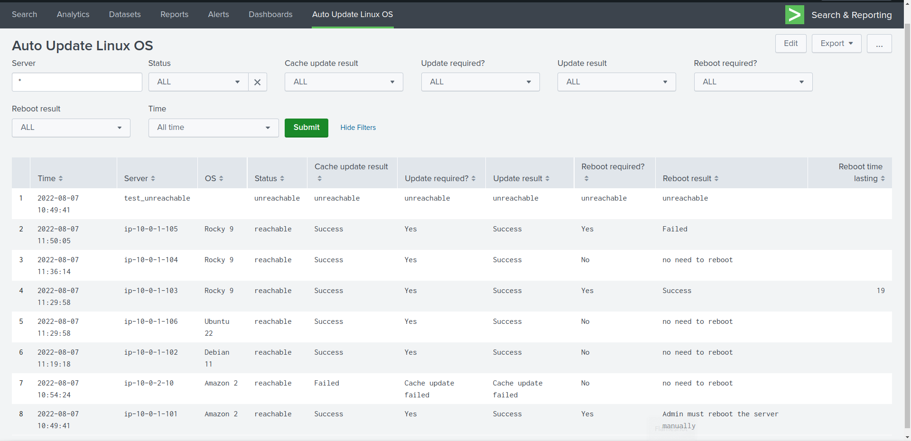

# AutoUpdate-Linux-OS
## Description
This repo lets you update the most popular Linux distributions (RedHat and Debian based) with Ansible.
The main objective of the repo is achieved when you use it alongside Splunk or something like that. If you do so, you can use a user-friendly dashboard I've created and see everything that has happened during the update process. Likewise, you can set different alerts for various events.

## Motivation

Automating boring stuff is so cool, and even in a large environment is essential. Therefore I decided to automate the updating process across all Linux servers.

First, I've written an Ansible playbook to do that but running the playbook was boring too. Thus I added it to crontab to execute at an interval time, but a problem arose here. How can I find out if any servers had a problem or even whether the playbook was run or not?

From this point of view, I've written the playbook's result to a file and monitored it with Splunk.
Afterward, I created a dashboard to view the result of the updating process. 

Finally, I created alerts for each situation that may be happened. For example, if there isn't any event, therefore the playbook was not run properly. Or, if the cache update fails, send an email to someone in charge.

Having the dashboard is also beneficial as you have a complete history of the updating process across your environment. For example, you can see what server was unreachable a year ago or what server couldn't boot normally after rebooting by Ansible.

## Getting Started

There are four plays based on two things:

1- how to update the OS

2- how to reboot the server

|              | Update | Reboot | Associated Variables |
|    :---:     |      :---:     |     :---:     |     :---     |
| 1 | All OS and other packages | just check by Ansible | <ul><li>redhat_excluse = 0</li><li>debian_excluse = 0</li><li>reboot = 0</li></ul> |
| 2 | All OS and other packages | automatically by Ansible | <ul><li>redhat_excluse = 0</li><li>debian_excluse = 0</li><li>reboot = 1</li></ul> |
| 3 | Some packages exclude from update | just check by Ansible | <ul><li>redhat_excluse = 1</li><li>debian_excluse = 1</li><li>reboot = 0</li></ul> |
| 4 | Some packages exclude from update | automatically by Ansible | <ul><li>redhat_excluse = 1</li><li>debian_excluse = 1</li><li>reboot = 1</li></ul> |

## Modules used:
##### 1-yum: 
* It provides exclude parameter so I've used it

##### 2-apt: 
* It doesn't provide a straightforward solution to exclude some apps. So I had to use some tricks and regular expressions to solve the problem.

## Variables:  

| variable | description |
| :---: | :---: | 
| path_log | path for storing the result (if you use Splunk please monitor this path or change the path to a path that Splunk monitor it) |
| to_retry | How many times does Ansible retry the task |
| throttling | Restriction the task execution |
| reboot_timeout_seconds | How many seconds Ansible waits after rebooting the server to connect to |
| redhat_exclude_packages | A list of packages (RedHat based) you don't want to be upgraded |
| debian_exclude_packages | A list of packages (Debian based) you don't want to be upgraded |

## Splunk dashboard


## Notes:

* If you have CentOS 7 in your environment make sure that ```yum-utils``` package is installed.
* If you have servers with ```redhat_excluse = 1``` or ```debian_excluse = 1``` make sure there is at least one package in exclude section in the vars file
